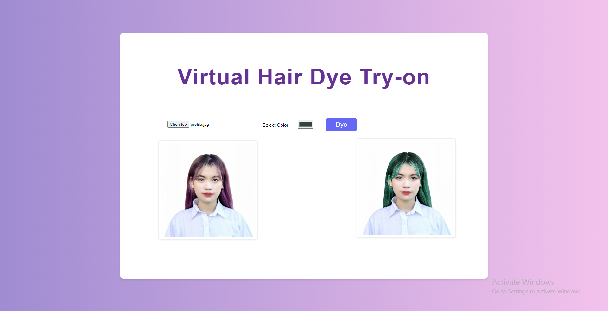

# Virtual Hair Dye Try-on Web Application
In recent years, there has been a growing trend in the use of hair dye as a means of exploring various styles and transforming one's appearance. With the continuous advancement of technology, a new trend has emerged - virtual hair dye. The primary focus of this project is to introduce a solution for virtual hair dye, with emphasis on the key processes of hair segmentation and recoloring. The proposed solution leverages advanced algorithms and image processing techniques to identify and isolate the hair region in an image. This allows users to preview and apply different hair colors with ease, without the risk or commitment associated with traditional hair dyeing methods. The virtual hair dye technology enables individuals to discover their ideal hair color without any adverse effects. 

Web App Demo
|:-------------------------:
|


Installation
---------------
```
git clone https://github.com/lltlien/Virtual-Hair-Dye-Try-on-Web-Application.git
cd Virtual-Hair-Dye-Try-on-Web-Application
```
Requirements
----
```
Flask==2.2.2
numpy==1.24.3
opencv_contrib_python==4.5.5.62
Pillow==9.4.0
scikit_image==0.19.3
torch==2.0.1
torchvision==0.15.2
```
Ensure you have Node.js installed on your system.
#### [Install Node.js](https://nodejs.org/en/)
Quick Usage
---------------
First cd into the ```frontend``` folder, install all dependicies and run frontend.

```bash
cd frontend
npm install
npm start
```
Create virtual environment:
```
py -m venv env
env\Scripts\activate
pip install -r requirements.txt
```
To run backend: 
```
py app.py
```
Once both frontend and backend are running, open [http://localhost:3000](http://localhost:3000) in your browser to access the application.
